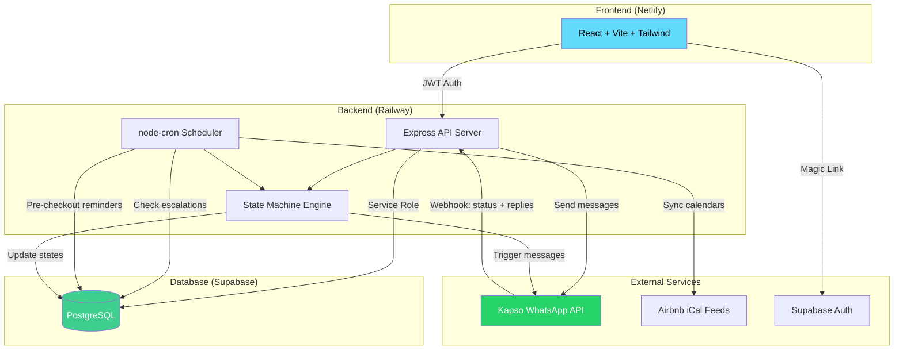

# Aseo Alerta MVP v1 — Arquitectura Técnica

## WhatsApp-First Coordination System via Kapso

**Fecha:** 2026-04-08
**Versión:** 1.0
**Estado:** Propuesta de diseño (pre-implementación)

---

## 1. Diagrama de Arquitectura del Sistema



### Flujo ASCII simplificado

```
┌──────────┐     ┌──────────────┐     ┌──────────┐     ┌──────────┐
│  Airbnb  │────▶│   Backend    │────▶│  Kapso   │────▶│ Marisol  │
│  iCal    │     │  (Railway)   │     │ WhatsApp │     │ (Limpieza│
└──────────┘     │              │     │   API    │     └────┬─────┘
                 │  ┌────────┐  │     └────┬─────┘          │
                 │  │ Cron   │  │          │            Responde
                 │  │ Jobs   │  │          │            por WhatsApp
                 │  └────────┘  │     ┌────▼─────┐          │
                 │              │◀────│ Webhooks │◀─────────┘
┌──────────┐     │  ┌────────┐  │     │ (status  │
│  Pedro   │◀───▶│  │ State  │  │     │ + reply) │
│ (Dueño)  │     │  │Machine │  │     └──────────┘
│ Web App  │     │  └────────┘  │
└──────────┘     │              │
                 │  ┌────────┐  │
                 │  │Supabase│  │
                 │  │  DB    │  │
                 │  └────────┘  │
                 └──────────────┘
```

---

## 2. Modelo de Datos Actualizado

### 2.1 Tablas Existentes (con modificaciones)

Las tablas `properties`, `reservations` y `subscriptions` se mantienen. La tabla `alerts` se depreca en favor de `notifications` y `messages_log`.

### 2.2 Migración SQL Completa: `003_whatsapp_coordination.sql`

```sql
-- ============================================================================
-- MIGRATION 003: WhatsApp Coordination System
-- ============================================================================

-- ─── NUEVA TABLA: cleaners ─────────────────────────────────────────────────
-- Contactos de limpieza, separados de properties para reutilización
CREATE TABLE cleaners (
    id              UUID PRIMARY KEY DEFAULT gen_random_uuid(),
    user_id         UUID NOT NULL REFERENCES auth.users(id) ON DELETE CASCADE,
    name            TEXT NOT NULL,
    phone           TEXT NOT NULL,          -- E.164: +56912345678
    notes           TEXT,
    active          BOOLEAN DEFAULT true,
    created_at      TIMESTAMPTZ DEFAULT now(),
    updated_at      TIMESTAMPTZ DEFAULT now()
);

CREATE INDEX idx_cleaners_user ON cleaners(user_id);

-- ─── MODIFICAR TABLA: properties ───────────────────────────────────────────
-- Agregar referencia a cleaner y modo de notificación
ALTER TABLE properties
    ADD COLUMN cleaner_id       UUID REFERENCES cleaners(id) ON DELETE SET NULL,
    ADD COLUMN notification_mode TEXT DEFAULT 'approval' 
        CHECK (notification_mode IN ('auto', 'approval')),
    ADD COLUMN checkout_time    TEXT DEFAULT '11:00',  -- Hora de checkout por defecto
    ADD COLUMN checkin_time     TEXT DEFAULT '15:00';   -- Hora de checkin por defecto

COMMENT ON COLUMN properties.notification_mode IS 
    'auto = enviar WhatsApp inmediatamente al detectar reserva; approval = esperar confirmación del dueño';

-- ─── NUEVA TABLA: notifications ────────────────────────────────────────────
-- Reemplaza "alerts". Cada notificación es una tarea de coordinación completa.
CREATE TABLE notifications (
    id              UUID PRIMARY KEY DEFAULT gen_random_uuid(),
    property_id     UUID NOT NULL REFERENCES properties(id) ON DELETE CASCADE,
    reservation_id  UUID NOT NULL REFERENCES reservations(id) ON DELETE CASCADE,
    cleaner_id      UUID NOT NULL REFERENCES cleaners(id) ON DELETE RESTRICT,
    
    -- Tipo y estado
    type            TEXT NOT NULL CHECK (type IN (
                        'new_reservation',      -- Reserva nueva detectada
                        'pre_checkout_reminder', -- Recordatorio día antes
                        'manual_resend'          -- Reenvío manual del dueño
                    )),
    status          TEXT NOT NULL DEFAULT 'pending_approval' CHECK (status IN (
                        'pending_approval',     -- Esperando aprobación del dueño (modo approval)
                        'pending_notification', -- Aprobado, listo para enviar
                        'notified',             -- Mensaje enviado a cleaner
                        'confirmed',            -- Cleaner respondió OK
                        'no_response',          -- Sin respuesta después de timeout
                        'escalated',            -- Escalado al dueño
                        'resolved'              -- Dueño resolvió (cualquier vía)
                    )),
    
    -- Contexto del mensaje
    message_text    TEXT,                   -- Texto enviado al cleaner
    reply_text      TEXT,                   -- Respuesta del cleaner (si hay)
    
    -- Escalación
    escalation_count INT DEFAULT 0,         -- Cuántas veces se ha escalado
    escalated_at    TIMESTAMPTZ,
    resolved_at     TIMESTAMPTZ,
    resolved_by     TEXT,                   -- 'cleaner_reply', 'owner_manual', 'owner_resend', 'owner_call'
    
    -- Timestamps
    sent_at         TIMESTAMPTZ,            -- Cuándo se envió el WhatsApp
    delivered_at    TIMESTAMPTZ,            -- Cuándo Kapso confirmó entrega
    read_at         TIMESTAMPTZ,            -- Cuándo el cleaner leyó
    replied_at      TIMESTAMPTZ,            -- Cuándo el cleaner respondió
    
    created_at      TIMESTAMPTZ DEFAULT now(),
    updated_at      TIMESTAMPTZ DEFAULT now()
);

CREATE INDEX idx_notifications_property ON notifications(property_id);
CREATE INDEX idx_notifications_reservation ON notifications(reservation_id);
CREATE INDEX idx_notifications_status ON notifications(status);
CREATE INDEX idx_notifications_pending ON notifications(status, sent_at) 
    WHERE status IN ('notified', 'no_response');

-- ─── NUEVA TABLA: messages_log ─────────────────────────────────────────────
-- Log detallado de cada mensaje individual enviado/recibido vía Kapso
CREATE TABLE messages_log (
    id              UUID PRIMARY KEY DEFAULT gen_random_uuid(),
    notification_id UUID REFERENCES notifications(id) ON DELETE CASCADE,
    
    -- Identificadores de Kapso/WhatsApp
    kapso_message_id TEXT,                  -- ID devuelto por Kapso al enviar
    wa_message_id    TEXT,                  -- WhatsApp message ID (del webhook)
    
    -- Dirección y contenido
    direction       TEXT NOT NULL CHECK (direction IN ('outbound', 'inbound')),
    message_type    TEXT NOT NULL DEFAULT 'text' CHECK (message_type IN (
                        'text', 'template', 'interactive', 'reaction'
                    )),
    content         TEXT NOT NULL,           -- Texto del mensaje
    
    -- Destinatario/remitente
    phone_from      TEXT,
    phone_to        TEXT,
    
    -- Estado del mensaje (webhook de Kapso)
    status          TEXT NOT NULL DEFAULT 'queued' CHECK (status IN (
                        'queued',       -- En cola para enviar
                        'sent',         -- Enviado a WhatsApp
                        'delivered',    -- Entregado al dispositivo
                        'read',         -- Leído por destinatario
                        'failed',       -- Error en envío
                        'received'      -- Mensaje entrante recibido
                    )),
    error_code      TEXT,
    error_detail    TEXT,
    
    -- Timestamps
    sent_at         TIMESTAMPTZ,
    delivered_at    TIMESTAMPTZ,
    read_at         TIMESTAMPTZ,
    
    created_at      TIMESTAMPTZ DEFAULT now()
);

CREATE INDEX idx_messages_notification ON messages_log(notification_id);
CREATE INDEX idx_messages_kapso_id ON messages_log(kapso_message_id);
CREATE INDEX idx_messages_wa_id ON messages_log(wa_message_id);
CREATE INDEX idx_messages_phone ON messages_log(phone_from);

-- ─── NUEVA TABLA: owner_actions_log ────────────────────────────────────────
-- Registro de acciones del dueño durante escalaciones
CREATE TABLE owner_actions_log (
    id              UUID PRIMARY KEY DEFAULT gen_random_uuid(),
    notification_id UUID NOT NULL REFERENCES notifications(id) ON DELETE CASCADE,
    user_id         UUID NOT NULL REFERENCES auth.users(id),
    action          TEXT NOT NULL CHECK (action IN (
                        'approved',         -- Aprobó envío (modo approval)
                        'resend',           -- Pidió reenviar mensaje
                        'will_call',        -- "Yo la llamo"
                        'change_cleaner',   -- Cambió contacto de limpieza
                        'mark_resolved'     -- Marcó como resuelto
                    )),
    metadata        JSONB,                  -- Datos extra (ej: nuevo cleaner_id)
    created_at      TIMESTAMPTZ DEFAULT now()
);

CREATE INDEX idx_owner_actions_notification ON owner_actions_log(notification_id);

-- ─── RLS POLICIES ──────────────────────────────────────────────────────────

ALTER TABLE cleaners ENABLE ROW LEVEL SECURITY;
CREATE POLICY "Users manage own cleaners" ON cleaners
    FOR ALL USING (user_id = auth.uid());

ALTER TABLE notifications ENABLE ROW LEVEL SECURITY;
CREATE POLICY "Users see own notifications" ON notifications
    FOR ALL USING (
        property_id IN (SELECT id FROM properties WHERE user_id = auth.uid())
    );

ALTER TABLE messages_log ENABLE ROW LEVEL SECURITY;
CREATE POLICY "Users see own messages" ON messages_log
    FOR ALL USING (
        notification_id IN (
            SELECT n.id FROM notifications n
            JOIN properties p ON p.id = n.property_id
            WHERE p.user_id = auth.uid()
        )
    );

ALTER TABLE owner_actions_log ENABLE ROW LEVEL SECURITY;
CREATE POLICY "Users see own actions" ON owner_actions_log
    FOR ALL USING (user_id = auth.uid());

-- ─── TRIGGERS ──────────────────────────────────────────────────────────────

CREATE TRIGGER set_updated_at_cleaners
    BEFORE UPDATE ON cleaners
    FOR EACH ROW EXECUTE FUNCTION update_updated_at();

CREATE TRIGGER set_updated_at_notifications
    BEFORE UPDATE ON notifications
    FOR EACH ROW EXECUTE FUNCTION update_updated_at();
```

### 2.3 Diagrama ER

```
┌─────────────┐     ┌──────────────┐     ┌──────────────┐
│   users      │────▶│  properties  │────▶│ reservations │
│  (Supabase)  │     │              │     │              │
└──────┬───────┘     │  cleaner_id ─┼──┐  └──────┬───────┘
       │             │  notif_mode  │  │         │
       │             └──────────────┘  │         │
       │                               │         │
       ▼                               ▼         │
┌──────────────┐              ┌──────────────┐   │
│   cleaners   │              │notifications │◀──┘
│              │◀─────────────│              │
│  name, phone │              │  type        │
└──────────────┘              │  status      │
                              │  sent_at     │
                              │  read_at     │
                              │  replied_at  │
                              └──────┬───────┘
                                     │
                         ┌───────────┼───────────┐
                         ▼                       ▼
                  ┌──────────────┐     ┌──────────────────┐
                  │ messages_log │     │ owner_actions_log │
                  │              │     │                   │
                  │ kapso_msg_id │     │ action            │
                  │ direction    │     │ metadata          │
                  │ status       │     └──────────────────┘
                  └──────────────┘
```

---

## 3. API Endpoints

### 3.1 Endpoints Existentes (sin cambios)

| Método | Ruta | Descripción | Auth |
|--------|------|-------------|------|
| GET | `/health` | Health check | No |
| GET | `/api/properties` | Listar propiedades del usuario | JWT |
| GET | `/api/properties/:id` | Detalle de propiedad | JWT |
| POST | `/api/properties` | Crear propiedad | JWT |
| PATCH | `/api/properties/:id` | Actualizar propiedad | JWT |
| DELETE | `/api/properties/:id` | Eliminar propiedad | JWT |
| POST | `/api/properties/:id/sync` | Sync manual de iCal | JWT + Rate limit |
| GET | `/api/properties/:id/reservations` | Listar reservas | JWT |
| GET | `/api/properties/:id/alerts` | *DEPRECADO → usar notifications* | JWT |
| GET | `/api/subscription` | Estado de suscripción | JWT |
| POST | `/api/subscription` | Crear suscripción | JWT |
| DELETE | `/api/subscription` | Cancelar suscripción | JWT |
| POST | `/api/subscription/webhook` | Webhook de Toku | Signature |

### 3.2 Endpoints Existentes (modificados)

| Método | Ruta | Cambio |
|--------|------|--------|
| POST | `/api/properties` | Acepta `cleaner_id`, `notification_mode`, `checkout_time`, `checkin_time` |
| PATCH | `/api/properties/:id` | Acepta los mismos campos nuevos |

### 3.3 Endpoints Nuevos — Cleaners

| Método | Ruta | Descripción | Auth |
|--------|------|-------------|------|
| GET | `/api/cleaners` | Listar cleaners del usuario | JWT |
| POST | `/api/cleaners` | Crear cleaner (name, phone) | JWT |
| PATCH | `/api/cleaners/:id` | Actualizar cleaner | JWT |
| DELETE | `/api/cleaners/:id` | Eliminar cleaner (si no tiene notificaciones activas) | JWT |

### 3.4 Endpoints Nuevos — Notifications

| Método | Ruta | Descripción | Auth |
|--------|------|-------------|------|
| GET | `/api/properties/:id/notifications` | Listar notificaciones de una propiedad | JWT |
| GET | `/api/notifications/:id` | Detalle de notificación con messages_log | JWT |
| POST | `/api/notifications/:id/approve` | Aprobar envío (modo approval) | JWT |
| POST | `/api/notifications/:id/resolve` | Marcar como resuelto manualmente | JWT |
| POST | `/api/notifications/:id/resend` | Reenviar mensaje al cleaner | JWT |
| POST | `/api/notifications/:id/action` | Registrar acción del dueño (will_call, change_cleaner, etc.) | JWT |

### 3.5 Endpoints Nuevos — Webhooks

| Método | Ruta | Descripción | Auth |
|--------|------|-------------|------|
| POST | `/api/webhook/whatsapp` | Recibir webhooks de Kapso (status updates + incoming messages) | Kapso Signature |
| GET | `/api/webhook/whatsapp` | Verificación de webhook (challenge de Meta/Kapso) | Query token |

### 3.6 Endpoint de Dashboard (nuevo)

| Método | Ruta | Descripción | Auth |
|--------|------|-------------|------|
| GET | `/api/dashboard/summary` | Resumen: notificaciones activas, pendientes de respuesta, escaladas | JWT |

---

## 4. Integración con Kapso (WhatsApp Business API)

### 4.1 Enviar Mensajes

**Base URL:** `https://api.kapso.ai/meta/whatsapp/v24.0/{KAPSO_PHONE_ID}/messages`

**Headers:**
```
Authorization: Bearer {KAPSO_API_KEY}
Content-Type: application/json
```

**Enviar mensaje de texto:**
```javascript
// POST https://api.kapso.ai/meta/whatsapp/v24.0/{phoneId}/messages
{
    "messaging_product": "whatsapp",
    "to": "+56912345678",
    "type": "text",
    "text": {
        "body": "🏠 Nueva reserva en Casa Playa...",
        "preview_url": false
    }
}
```

**Respuesta exitosa:**
```json
{
    "messaging_product": "whatsapp",
    "contacts": [{ "wa_id": "56912345678" }],
    "messages": [{ "id": "wamid.HBgNNTY5..." }]
}
```

El campo `messages[0].id` se guarda como `kapso_message_id` en `messages_log` para correlacionar con los webhooks de status.

### 4.2 Recibir Webhooks de Kapso

Kapso reenvía los webhooks estándar de la API de WhatsApp Business. El backend recibe dos tipos de evento en `POST /api/webhook/whatsapp`:

**Tipo A — Status Updates (mensaje saliente)**

Cuando un mensaje que enviamos cambia de estado (sent → delivered → read):

```json
{
    "entry": [{
        "changes": [{
            "value": {
                "messaging_product": "whatsapp",
                "metadata": { "phone_number_id": "..." },
                "statuses": [{
                    "id": "wamid.HBgNNTY5...",
                    "status": "delivered",
                    "timestamp": "1712580000",
                    "recipient_id": "56912345678"
                }]
            }
        }]
    }]
}
```

**Status posibles:** `sent`, `delivered`, `read`, `failed`

**Tipo B — Incoming Messages (respuesta del cleaner)**

Cuando Marisol responde al mensaje:

```json
{
    "entry": [{
        "changes": [{
            "value": {
                "messaging_product": "whatsapp",
                "messages": [{
                    "id": "wamid.HBgNNTY5...",
                    "from": "56912345678",
                    "timestamp": "1712580100",
                    "type": "text",
                    "text": { "body": "OK, listo, estaré ahí" },
                    "context": {
                        "message_id": "wamid.ORIGINAL..."
                    }
                }]
            }
        }]
    }]
}
```

### 4.3 Webhook Handler — Lógica

```
POST /api/webhook/whatsapp
│
├─ ¿Es status update?
│  └─ Buscar en messages_log por kapso_message_id
│     └─ Actualizar status (sent/delivered/read/failed)
│     └─ Actualizar timestamps en notification (delivered_at, read_at)
│     └─ Si owner tiene web abierta → puede ver cambio en tiempo real via polling
│
├─ ¿Es incoming message?
│  └─ Buscar cleaner por phone_from
│     └─ Buscar notification más reciente activa para ese cleaner
│        └─ Guardar reply en messages_log (direction: 'inbound')
│        └─ Actualizar notification: status → 'confirmed', replied_at, reply_text
│        └─ Enviar WhatsApp de confirmación al dueño (via su phone)
│
└─ Responder 200 OK (siempre, para evitar reintentos de Kapso)
```

### 4.4 Verificación de Webhook

Kapso/Meta requiere verificar la URL del webhook con un GET:

```
GET /api/webhook/whatsapp?hub.mode=subscribe&hub.verify_token=MI_TOKEN&hub.challenge=CHALLENGE
```

El backend verifica que `hub.verify_token` coincida con `KAPSO_WEBHOOK_VERIFY_TOKEN` y responde con el `hub.challenge`.

### 4.5 Seguridad del Webhook

Verificar la firma HMAC-SHA256 en cada request:

```javascript
const crypto = require('crypto');

function verifyKapsoSignature(req) {
    const signature = req.headers['x-hub-signature-256'];
    if (!signature) return false;
    
    const expectedSig = 'sha256=' + crypto
        .createHmac('sha256', process.env.KAPSO_APP_SECRET)
        .update(req.rawBody)
        .digest('hex');
    
    return crypto.timingSafeEqual(
        Buffer.from(signature),
        Buffer.from(expectedSig)
    );
}
```

### 4.6 Variables de Entorno Nuevas

```env
# Kapso (existentes, renombrar para claridad)
KAPSO_API_KEY=kapso_...
KAPSO_PHONE_ID=123456789

# Kapso (nuevas)
KAPSO_APP_SECRET=abc123...              # Para verificar firma de webhooks
KAPSO_WEBHOOK_VERIFY_TOKEN=mi_token_secreto  # Para verificación inicial GET
```

---

## 5. Plantillas de Mensajes WhatsApp (en Español)

### 5.1 Nueva Reserva → Cleaner

```
🏠 *Aviso de limpieza — {property_name}*
De parte de {owner_name}

📅 Check-in: {checkin_date} a las {checkin_time}
📅 Check-out: {checkout_date} a las {checkout_time}
👤 Huésped: {guest_name}

Por favor confirma que puedes encargarte respondiendo a este mensaje.

¡Gracias! 🙏
```

### 5.2 Recordatorio Pre-Checkout → Cleaner

```
🔔 *Recordatorio de limpieza — {property_name}*
De parte de {owner_name}

⏰ Mañana {checkout_date} a las {checkout_time} es el checkout.

👤 Huésped actual: {guest_name}
📅 Próximo check-in: {next_checkin_date} a las {next_checkin_time}

Por favor confirma que estás lista respondiendo a este mensaje. ¡Gracias!
```

### 5.3 Status Update → Owner (mensaje enviado)

```
✅ *Notificación enviada*
Se envió el aviso de limpieza a {cleaner_name} para {property_name}.

📅 Checkout: {checkout_date}
📱 Estado: Enviado

Te avisaremos cuando lo lea y responda.
```

### 5.4 Status Update → Owner (cleaner leyó)

```
👀 *Mensaje leído*
{cleaner_name} leyó el aviso de limpieza para {property_name}.

Esperando su confirmación...
```

### 5.5 Status Update → Owner (cleaner confirmó)

```
✅ *¡Confirmado!*
{cleaner_name} confirmó la limpieza de {property_name}.

💬 Respondió: "{reply_text}"

📅 Checkout: {checkout_date} a las {checkout_time}
```

### 5.6 Escalación → Owner (sin respuesta)

```
⚠️ *Sin respuesta — {property_name}*

{cleaner_name} no ha respondido al aviso de limpieza después de {hours}h.

📅 Checkout: {checkout_date}

¿Qué quieres hacer?
1️⃣ Reenviar mensaje
2️⃣ Yo la llamo directamente
3️⃣ Cambiar contacto de limpieza
4️⃣ Ya está resuelto

Responde con el número de tu opción.
```

### 5.7 Confirmación de Acción → Owner

```
👍 *Acción registrada*
{action_description}

Te mantendremos informado.
```

**Nota sobre envío al Owner:** En MVP v1, las notificaciones al dueño se envían por WhatsApp al número `properties.whatsapp_phone`. Si el dueño también está conectado a la web app, verá los estados en tiempo real en la página de detalle de notificación.

---

## 6. Scheduler / Cron Jobs

### 6.1 Jobs Existentes (modificados)

| Job | Schedule | Cambio |
|-----|----------|--------|
| **Daily iCal Sync** | `0 9 * * *` (06:00 Chile) | Ahora crea `notification` en vez de `alert`. Si `notification_mode = 'auto'`, envía inmediatamente. Si `'approval'`, crea con status `pending_approval` y notifica al dueño para que apruebe. |
| **Pre-Checkout Reminder** | `0 12 * * *` (09:00 Chile) | Ahora crea nueva `notification` tipo `pre_checkout_reminder` y la procesa por la state machine. |

### 6.2 Jobs Nuevos

| Job | Schedule | Descripción |
|-----|----------|-------------|
| **Escalation Checker** | `*/30 * * * *` (cada 30 min) | Busca notificaciones con `status = 'notified'` donde `sent_at < NOW() - INTERVAL '2 hours'` y `read_at IS NULL OR replied_at IS NULL`. Cambia status a `no_response` → `escalated`. Envía WhatsApp de escalación al dueño. |
| **Re-Escalation** | `0 */4 * * *` (cada 4 horas) | Busca notificaciones `escalated` sin resolver donde `escalated_at < NOW() - INTERVAL '4 hours'`. Reenvía recordatorio de escalación al dueño. Incrementa `escalation_count`. |
| **Stale Notification Cleanup** | `0 3 * * *` (00:00 Chile) | Marca como `resolved` las notificaciones donde el checkout ya pasó (la limpieza ya ocurrió o no) con `resolved_by = 'auto_expired'`. |

### 6.3 Detalle del Escalation Checker

```javascript
// Pseudocódigo
async function checkEscalations() {
    // 1. Buscar notificaciones sin respuesta después de 2h
    const stale = await db.query(`
        SELECT n.*, p.whatsapp_phone, p.name as property_name,
               c.name as cleaner_name, r.checkout
        FROM notifications n
        JOIN properties p ON p.id = n.property_id
        JOIN cleaners c ON c.id = n.cleaner_id
        JOIN reservations r ON r.id = n.reservation_id
        WHERE n.status = 'notified'
          AND n.sent_at < NOW() - INTERVAL '2 hours'
          AND n.replied_at IS NULL
    `);
    
    for (const notif of stale) {
        // 2. Actualizar status
        await db.update('notifications', notif.id, {
            status: 'escalated',
            escalated_at: new Date(),
            escalation_count: notif.escalation_count + 1
        });
        
        // 3. Enviar escalación al dueño por WhatsApp
        await sendWhatsApp(notif.whatsapp_phone, 
            buildEscalationMessage(notif));
        
        // 4. Log del mensaje
        await db.insert('messages_log', { ... });
    }
}
```

---

## 7. State Machine de Notificaciones

### 7.1 Diagrama de Estados

```
                    ┌────────────────┐
                    │ iCal Sync      │
                    │ detecta reserva│
                    └───────┬────────┘
                            │
                            ▼
              ┌─────────────────────────┐
              │                         │
    mode=auto │                         │ mode=approval
              │                         │
              ▼                         ▼
    ┌──────────────────┐    ┌────────────────────┐
    │pending_notification│   │  pending_approval   │
    └────────┬─────────┘    └─────────┬──────────┘
             │                        │
             │ auto-send              │ owner aprueba (POST /approve)
             │                        │
             ▼                        ▼
    ┌──────────────────────────────────┐
    │          notified                │ ← Mensaje enviado al cleaner
    │  (sent_at = now)                 │
    └──────────┬───────────────────────┘
               │
       ┌───────┼────────────────┐
       │       │                │
       │  Kapso webhook:    Kapso webhook:
       │  delivered/read    2h sin reply
       │       │                │
       │       ▼                ▼
       │  (timestamps      ┌──────────┐
       │   actualizados)   │no_response│
       │       │           └─────┬────┘
       │       │                 │
       │  Kapso webhook:    cron escala
       │  incoming reply        │
       │       │                ▼
       │       ▼          ┌───────────┐     Owner elige:
       │  ┌───────────┐   │ escalated │────────────────┐
       │  │ confirmed │   └─────┬─────┘                │
       │  └─────┬─────┘         │                      │
       │        │         Owner responde:              │
       │        │         resend/call/change            │
       │        ▼               │                      │
       │  ┌───────────┐         ▼                      ▼
       └─▶│ resolved  │◀──────────────────────────────┘
          └───────────┘
```

### 7.2 Transiciones Válidas

| Desde | Hacia | Trigger |
|-------|-------|---------|
| `pending_approval` | `pending_notification` | Owner aprueba vía web o WhatsApp |
| `pending_approval` | `resolved` | Owner cancela/rechaza |
| `pending_notification` | `notified` | Backend envía WhatsApp exitosamente |
| `pending_notification` | `pending_notification` | Error envío → reintento (max 3) |
| `notified` | `confirmed` | Cleaner responde por WhatsApp |
| `notified` | `no_response` | 2h sin respuesta (cron) |
| `notified` | `resolved` | Owner marca resuelto manualmente |
| `no_response` | `escalated` | Cron escala automáticamente |
| `escalated` | `notified` | Owner elige "reenviar" |
| `escalated` | `resolved` | Owner elige "yo la llamo" / "ya resuelto" |
| `escalated` | `pending_notification` | Owner elige "cambiar contacto" (con nuevo cleaner) |
| `confirmed` | `resolved` | Auto-resolve o owner cierra |

### 7.3 Implementación: `services/stateMachine.js`

```javascript
const VALID_TRANSITIONS = {
    'pending_approval':     ['pending_notification', 'resolved'],
    'pending_notification': ['notified'],
    'notified':             ['confirmed', 'no_response', 'resolved'],
    'no_response':          ['escalated'],
    'escalated':            ['notified', 'resolved', 'pending_notification'],
    'confirmed':            ['resolved'],
};

async function transitionNotification(notificationId, newStatus, metadata = {}) {
    const notification = await getNotification(notificationId);
    
    const allowed = VALID_TRANSITIONS[notification.status];
    if (!allowed || !allowed.includes(newStatus)) {
        throw new Error(
            `Transición inválida: ${notification.status} → ${newStatus}`
        );
    }
    
    // Actualizar status + timestamps según el nuevo estado
    const updates = { status: newStatus, ...metadata };
    
    switch (newStatus) {
        case 'notified':
            updates.sent_at = new Date();
            break;
        case 'confirmed':
            updates.replied_at = new Date();
            break;
        case 'escalated':
            updates.escalated_at = new Date();
            updates.escalation_count = (notification.escalation_count || 0) + 1;
            break;
        case 'resolved':
            updates.resolved_at = new Date();
            break;
    }
    
    await updateNotification(notificationId, updates);
    
    // Disparar side-effects (enviar mensajes, etc.)
    await handleSideEffects(notification, newStatus, metadata);
    
    return updates;
}
```

---

## 8. Lógica de Escalación

### 8.1 Reglas de Escalación

| Condición | Acción | Tiempo |
|-----------|--------|--------|
| Mensaje enviado, no leído ni respondido en 2h | Cambiar a `no_response` → `escalated` | sent_at + 2h |
| Mensaje leído pero no respondido en 2h | Cambiar a `no_response` → `escalated` | read_at + 2h (o sent_at + 2h, lo que sea menor) |
| Escalación sin respuesta del owner en 4h | Re-escalar (enviar otro recordatorio) | escalated_at + 4h |
| Max 3 re-escalaciones | Después de la 3ra, marcar como `resolved` con `resolved_by = 'auto_timeout'` | - |
| Checkout ya pasó | Auto-resolver notificación | Cron de limpieza nocturno |

### 8.2 Flujo de Escalación Detallado

```
Reserva detectada
    │
    ├─ mode=auto ──────▶ Enviar WhatsApp a Marisol
    │                         │
    │                    ┌────┴────────────────┐
    │                    │   Timer: 2 horas    │
    │                    └────┬────────────────┘
    │                         │
    │                    ¿Respondió?
    │                    ├─ SÍ → confirmed → notificar a Pedro ✅
    │                    │
    │                    └─ NO → escalated
    │                              │
    │                         WhatsApp a Pedro:
    │                         "Marisol no respondió. ¿Qué hacemos?"
    │                              │
    │                    ┌─────────┼─────────┐─────────┐
    │                    │         │         │         │
    │               "Reenviar" "Yo llamo" "Cambiar" "Resuelto"
    │                    │         │      contacto     │
    │                    │         │         │         │
    │                    ▼         ▼         ▼         ▼
    │               notified   resolved  pending    resolved
    │              (reinicia   (log:     _notif.   (log:
    │               timer)    will_call) (nuevo    mark_
    │                                    cleaner)  resolved)
    │
    └─ mode=approval ──▶ WhatsApp a Pedro: "Nueva reserva. ¿Envío aviso?"
                              │
                         Pedro aprueba
                              │
                              ▼
                         (mismo flujo que auto desde aquí)
```

### 8.3 Respuesta del Owner a Escalaciones

Cuando el owner responde con un número (1-4) al mensaje de escalación, el webhook handler lo interpreta:

```javascript
function parseOwnerEscalationReply(text) {
    const trimmed = text.trim();
    const map = {
        '1': 'resend',
        '2': 'will_call',
        '3': 'change_cleaner',
        '4': 'mark_resolved',
    };
    return map[trimmed] || null;
}
```

Si la respuesta no es un número válido, el bot responde: "No entendí tu respuesta. Responde con 1, 2, 3 o 4."

---

## 9. Cambios en Backend Actual vs Código Nuevo

### 9.1 Archivos Existentes que Cambian

| Archivo | Cambio |
|---------|--------|
| `index.js` | Agregar rutas: `/api/cleaners`, `/api/notifications`, `/api/webhook/whatsapp`, `/api/dashboard`. Agregar raw body parser para webhook de Kapso (igual que Toku). |
| `routes/properties.js` | Modificar POST y PATCH para aceptar `cleaner_id`, `notification_mode`, `checkout_time`, `checkin_time`. Agregar GET `/:id/notifications`. |
| `services/sync.js` | `syncProperty()` ahora crea `notification` en vez de `alert`. Respetar `notification_mode` (auto vs approval). Buscar `cleaner_id` de la propiedad. |
| `services/whatsapp.js` | Refactorizar para devolver el `message_id` de Kapso. Agregar funciones para todos los templates nuevos. Agregar `sendToOwner()`. |
| `services/cron.js` | Modificar pre-checkout job para usar notifications. Agregar escalation checker (cada 30 min). Agregar re-escalation (cada 4h). Agregar stale cleanup (diario). |

### 9.2 Archivos Nuevos

| Archivo | Propósito |
|---------|-----------|
| `routes/cleaners.js` | CRUD de contactos de limpieza |
| `routes/notifications.js` | Endpoints de notificaciones (approve, resolve, resend, action) |
| `routes/webhookWhatsapp.js` | Handler del webhook de Kapso |
| `routes/dashboard.js` | Endpoint de resumen para dashboard |
| `services/stateMachine.js` | Motor de transición de estados con side-effects |
| `services/escalation.js` | Lógica de escalación y re-escalación |
| `services/messageTemplates.js` | Todas las plantillas de mensajes en español |
| `services/ownerNotifier.js` | Lógica para enviar updates al dueño |
| `middleware/webhookAuth.js` | Verificación de firma HMAC para webhooks de Kapso |

### 9.3 Tabla de Deprecación

| Componente | Estado | Reemplazo |
|------------|--------|-----------|
| Tabla `alerts` | Deprecada (no eliminar aún) | `notifications` + `messages_log` |
| `GET /api/properties/:id/alerts` | Deprecado | `GET /api/properties/:id/notifications` |
| `buildNewBookingMessage()` en whatsapp.js | Reemplazar | Templates en `messageTemplates.js` |
| `buildPreCheckoutMessage()` en whatsapp.js | Reemplazar | Templates en `messageTemplates.js` |

---

## 10. Orden de Implementación

### Fase 1 — Fundación (Semana 1)

**Objetivo:** Nuevas tablas + CRUD básico sin romper nada existente.

1. **Migración de base de datos** (`003_whatsapp_coordination.sql`)
   - Crear tablas: `cleaners`, `notifications`, `messages_log`, `owner_actions_log`
   - Alterar `properties` (nuevas columnas)
   - RLS policies
   - *No eliminar tabla `alerts`*

2. **CRUD de Cleaners** (`routes/cleaners.js`)
   - GET, POST, PATCH, DELETE
   - Validación de teléfono E.164

3. **Actualizar Properties** (`routes/properties.js`)
   - Aceptar `cleaner_id`, `notification_mode`, `checkout_time` en POST/PATCH
   - Frontend: agregar selector de cleaner al formulario de propiedad

### Fase 2 — State Machine + Envío (Semana 2)

**Objetivo:** Crear notificaciones y enviar mensajes con tracking.

4. **State Machine** (`services/stateMachine.js`)
   - Implementar transiciones válidas
   - Side-effects por transición

5. **Message Templates** (`services/messageTemplates.js`)
   - Todos los templates de §5

6. **Refactorizar Sync** (`services/sync.js`)
   - Crear `notification` en vez de `alert`
   - Respetar `notification_mode`
   - Guardar `message_id` de Kapso en `messages_log`

7. **Refactorizar WhatsApp Service** (`services/whatsapp.js`)
   - Devolver `message_id`
   - Funciones para enviar a cleaner y a owner

### Fase 3 — Webhooks + Tracking (Semana 3)

**Objetivo:** Recibir actualizaciones de estado y respuestas.

8. **Webhook Handler** (`routes/webhookWhatsapp.js`)
   - Verificación GET (challenge)
   - Verificación de firma HMAC
   - Handler de status updates → actualizar `messages_log` y `notifications`
   - Handler de incoming messages → detectar replies del cleaner y del owner

9. **Configurar Webhook en Kapso**
   - Registrar URL: `https://aseo-alerta-production.up.railway.app/api/webhook/whatsapp`
   - Suscribir a eventos: `messages`, `message_status`

10. **Owner Notifier** (`services/ownerNotifier.js`)
    - Enviar actualizaciones al dueño en cada cambio de estado

### Fase 4 — Escalación (Semana 4)

**Objetivo:** Detección automática de no-respuesta y opciones para el dueño.

11. **Escalation Service** (`services/escalation.js`)
    - Query de notificaciones stale
    - Lógica de re-escalación

12. **Cron Jobs Nuevos** (`services/cron.js`)
    - Escalation checker (cada 30 min)
    - Re-escalation (cada 4h)
    - Stale cleanup (nocturno)

13. **Parseo de Respuestas del Owner**
    - Interpretar "1", "2", "3", "4" en webhook handler
    - Ejecutar acción correspondiente via state machine

### Fase 5 — UI del Owner (Semana 5)

**Objetivo:** El dueño puede ver y gestionar todo desde la web.

14. **Notifications API** (`routes/notifications.js`)
    - GET listado, GET detalle con messages_log
    - POST approve, resolve, resend, action

15. **Dashboard Summary** (`routes/dashboard.js`)
    - Conteos de notificaciones por estado

16. **Frontend: Página de Notificaciones**
    - Timeline visual con estados (sent → delivered → read → confirmed)
    - Botones de acción para escalaciones
    - Vista de detalle con historial de mensajes

17. **Frontend: Dashboard actualizado**
    - Cards con indicadores de notificaciones activas
    - Alertas visuales para escalaciones pendientes

### Fase 6 — Hardening (Semana 6)

18. **Retry logic para envío de WhatsApp** (3 intentos con backoff exponencial)
19. **Idempotencia en webhooks** (deduplicar por `wa_message_id`)
20. **Tests de integración** (webhook handler, state machine, escalation)
21. **Logging y monitoring** (errores de Kapso, notificaciones fallidas)
22. **Migrar datos históricos** de `alerts` → `notifications` (script one-time)

---

## Apéndice A: Flujo Completo de Ejemplo

```
09:00  Cron sincroniza iCal de "Casa Playa" (propiedad de Pedro)
       → Detecta nueva reserva: checkout 15 de abril, huésped "John Smith"
       → Crea notification (type: new_reservation)
       → notification_mode = 'auto' → status: pending_notification

09:00  Backend envía WhatsApp a Marisol (+56912345678):
       "🏠 Aviso de limpieza — Casa Playa. De parte de Pedro..."
       → Kapso devuelve message_id: "wamid.abc123"
       → messages_log: {direction: outbound, status: queued}
       → notification status: notified

09:01  Kapso webhook: status = "sent"
       → messages_log status: sent

09:01  Kapso webhook: status = "delivered"
       → messages_log status: delivered
       → notification.delivered_at = now
       → WhatsApp a Pedro: "✅ Notificación enviada a Marisol..."

09:15  Kapso webhook: status = "read"
       → messages_log status: read
       → notification.read_at = now
       → WhatsApp a Pedro: "👀 Marisol leyó el aviso..."

09:22  Kapso webhook: incoming message from +56912345678
       → text: "Ok perfecto, ahí estaré"
       → messages_log: {direction: inbound, status: received}
       → notification status: confirmed, reply_text: "Ok perfecto..."
       → WhatsApp a Pedro: "✅ ¡Confirmado! Marisol confirmó..."

       ✅ Flujo completado exitosamente.
```

## Apéndice B: Flujo de Escalación

```
09:00  Mensaje enviado a Marisol (notification: notified)
09:01  Delivered ✓
       ... Marisol no lee ni responde ...

11:00  Cron Escalation Checker detecta: sent_at + 2h = pasó
       → notification status: no_response → escalated
       → WhatsApp a Pedro: "⚠️ Sin respuesta — Casa Playa. ¿Qué hacemos? 1/2/3/4"

11:05  Pedro responde "1" (reenviar)
       → owner_actions_log: {action: 'resend'}
       → notification status: escalated → notified (reset)
       → Nuevo WhatsApp a Marisol con mismo contenido
       → Timer reinicia

13:05  Segundo timeout sin respuesta
       → Segunda escalación a Pedro

13:10  Pedro responde "2" (yo la llamo)
       → owner_actions_log: {action: 'will_call'}
       → notification status: resolved, resolved_by: 'owner_call'
       → WhatsApp a Pedro: "👍 Acción registrada."

       ✅ Flujo de escalación completado.
```
